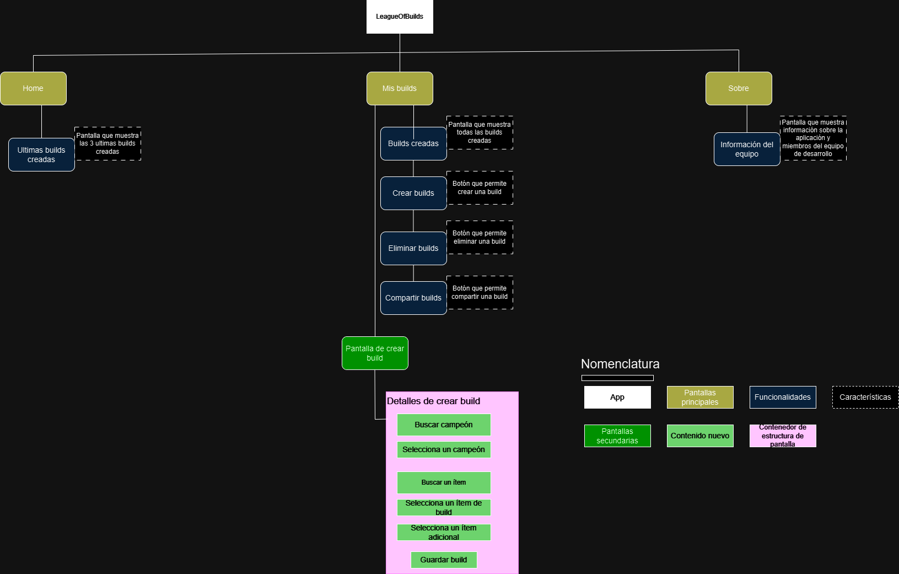

# league_of_builds

## Descripción
- League Of Builds es una aplicación de creación de builds del videojuego League Of Legends, esta permite seleccionar un campeón junto a 6 items principales más 6 items adicionales para crear una build personalizada, junto a la posibilidad de compartir, borrar y mantener persistencia de estas mismas builds.

## Principales características

- 1) LOB permite el almacenamiento de builds de manera persistente usando bases de datos.
- 2) LOB permite la recolección e interpretación de información de APIs.
- 3) LOB permite la asignación de imagenes para campeones e ítems.
- 4) LOB permite verificar tu conexión a internet.
- 5) LOB permite la crear y borrar builds personalizadas.
- 6) LOB permite compartir tus builds.
- 7) LOB permite visualizar las ultimas 3 builds creadas.

## Diagrama solicitado

- 

## APK

- [Apk](https://drive.google.com/file/d/12qELfLILGzAKhQ55iG0hbkk85YO71lqf/view?usp=sharing)

## URL de los videos

- [Video presentación](https://youtu.be/4a6zNk0NPZI)

- [Video uso de la app en un celular](https://drive.google.com/file/d/1HoKLIW9kc4m9pb-ZArkfjmjFqxbpv0Wv/view?usp=sharing)

## Links API

- https://ddragon.leagueoflegends.com/cdn/14.23.1/data/es_MX/item.json
- https://ddragon.leagueoflegends.com/cdn/14.23.1/data/es_MX/champion.json
- https://ddragon.leagueoflegends.com/api/versions.json
- https://ddragon.leagueoflegends.com/cdn/14.23.1/img/champion/Swain.png
- https://ddragon.leagueoflegends.com/cdn/14.23.1/img/item/1001.png

## Colores

- 0xFF1D334A (Azul oscuro)
- 0xFF15242F (Azul muy oscuro)
- 0xFFC79B3B (Dorado)
- 0xFFFFFFFF (Blanco)